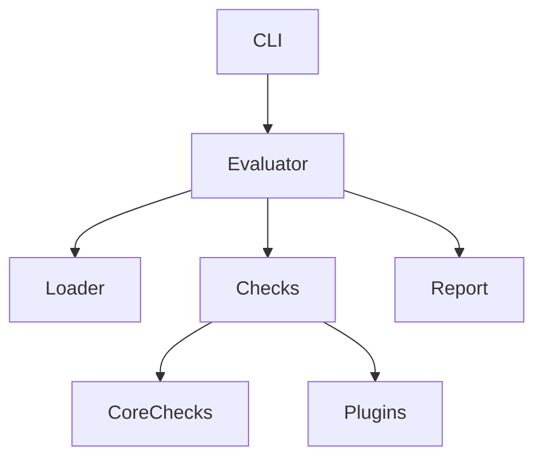

# Architecture

## Overview

RAICB is built with a modular architecture centered around the `Evaluator`.

## Components

- **CLI**: Entry point (Typer)
- **Evaluator**: Orchestrates execution
- **Loader**: Loads configuration
- **Checks**: Compliance logic
- **Report**: Generates outputs

